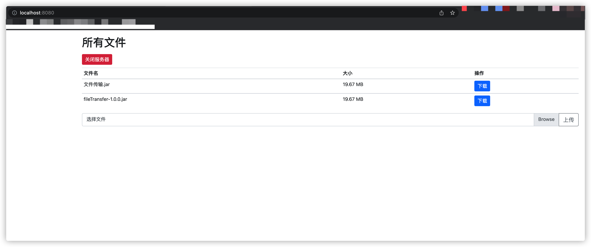

# 跨平台局域网文件传输系统

## 优势
## 跨平台
>包括但不限于，Windows，Android，IOS，MacBook...

### 使用SpringBoot开发

### 体积小
打包后只有20MB

### 运行方便
只要有Java运行环境，即可启动

### 运行不挑位置
在需要传输文件的目录下运行，自动扫描当前目录下的文件。

### 可上传可下载
Web页面，可以进行上传或下载文件操作

### 有一定的安全性
使用完，可在Web页面点击关闭服务按钮，即可关闭服务。

## 打包命令
```cmd
mvn clean package
```

## 启动命令

```cmd
java -jar fileTransfer-1.0.0.jar
```

然后打开http://ip:8080


